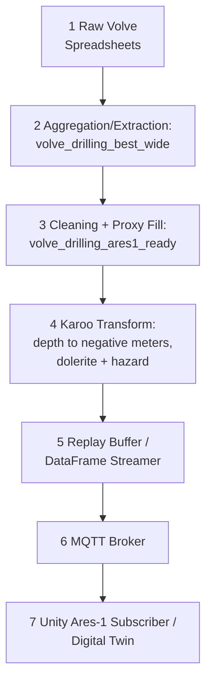

# Planned Data Flow (Volve -> Ares-1 -> Karoo -> MQTT)

## Pipeline Diagram (Numbered Stages)

## Stage-by-Stage Narrative

### 1) Raw Volve Spreadsheets

- Inputs: `data/volve/unsorted/*` (unzipped Volve well spreadsheets)
- Outputs: raw CSVs/spreadsheets for extraction
- Assumptions: files are complete and not modified in place
- Failure modes: missing ZIPs, corrupted spreadsheets, mismatched sheet names

### 2) Aggregation/Extraction

- Inputs: raw Volve spreadsheets
- Outputs: `data/volve_logs/volve_drilling_best.csv`, `data/volve_logs/volve_drilling_best_wide.csv`
- Assumptions: depth and ROP columns can be detected; vibration may be sparse
- Failure modes: missing depth column, malformed headers, extremely sparse signals

### 3) Ares-1 Ready Cleaning + Proxy Enrichment

- Inputs: `volve_drilling_best_wide.csv` (preferred) or `volve_drilling_best.csv`
- Outputs: `data/volve_logs/volve_drilling_ares1_ready.csv`
- Role: primary dataset for all downstream Ares-1 replay and Karoo steps
- Assumptions: TIME missing -> fixed tick replay, depth sorted
- Failure modes: proxy signals missing, negative depths not filtered, unstable interpolation

### 4) Karoo Transform (Geology Overrides)

- Inputs: Ares-1 ready dataset (primary dataset)
- Outputs: transformed telemetry (depth negative, status overrides)
- Assumptions: depth sorting is deterministic
- Failure modes: missing depth, invalid depth scaling, override zones not applied

### 5) Replay Buffer / DataFrame Streamer

- Inputs: transformed dataset rows
- Outputs: row-wise telemetry events for MQTT
- Assumptions: fixed tick defined by publisher (Hz)
- Failure modes: inconsistent ordering, skipped rows, tick drift

### 6) MQTT Broker

- Inputs: telemetry JSON events
- Outputs: MQTT topics (e.g., `ares1/telemetry/realtime`)
- Assumptions: broker reachable and stable
- Failure modes: broker unavailable, message drop, schema mismatch

### 7) Unity Ares-1 Subscriber / Digital Twin

- Inputs: MQTT telemetry stream
- Outputs: UI/state updates in Unity
- Assumptions: consistent schema and timing model
- Failure modes: parsing errors, visual lag, missing topic subscriptions

## Where We Inject Karoo Geology Overrides

Overrides are applied in Stage 4 (Karoo Transform):

- **Dolerite sill zone**: depth range **[-1375, -1225]** meters
  - Apply vibration multiplier and status override
- **Ecca hazard zone**: depth **<= -1400** meters
  - Apply hazard status and fallback safety rules

## Determinism & Replay Timing

- TIME is missing in Volve-derived datasets.
- Replay uses **fixed tick** timing controlled by the publisher (Hz).
- Ordering is deterministic: stable sort by depth, then sequential index.

## How To Run

1) `python scripts/analyze_volve_dataset_health.py`
2) Open `docs/dataset_health_report.md`
3) Open `docs/planned_data_flow.md`
4) Open `docs/dataset_usage_plan.md`
