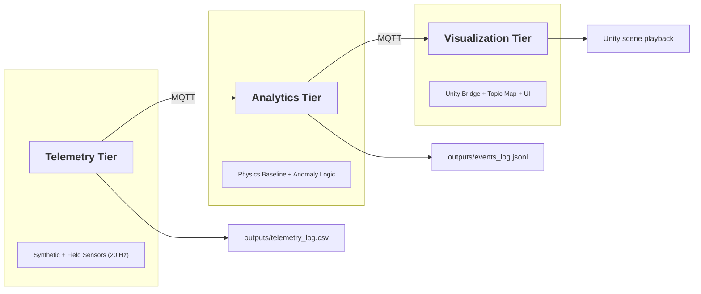

# Ares-1 System Overview

## Triple-Tier Ecosystem (Mermaid)

## Explanation

- Telemetry Tier: a synthetic publisher (or future rig data) emits JSON telemetry at 20 Hz.
- Analytics Tier: physics baseline + rolling z-score placeholder detects anomalies and
  publishes events to `ares1/events/anomaly`.
- Visualization Tier: Unity stubs consume the same topic map for playback or live views.

## Data Flow

1) Publisher writes to `ares1/telemetry/*`.
2) Subscriber writes `outputs/telemetry_latest.json`.
3) Anomaly detector emits `ares1/events/anomaly`.
4) Event subscriber appends to `outputs/events_log.jsonl`.
